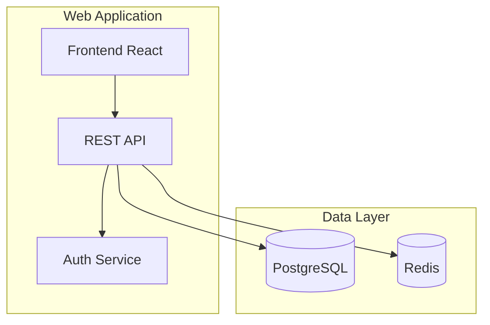
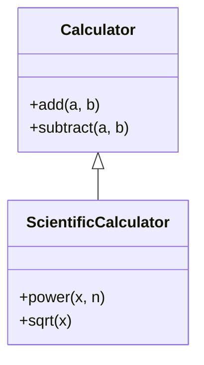
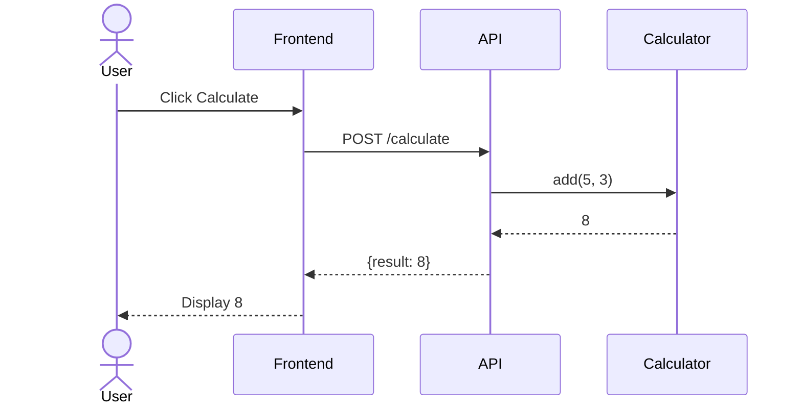
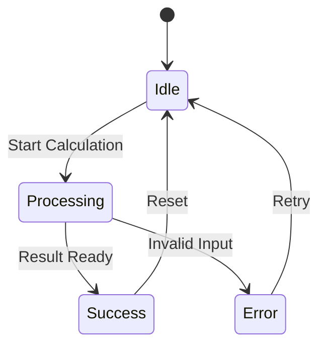
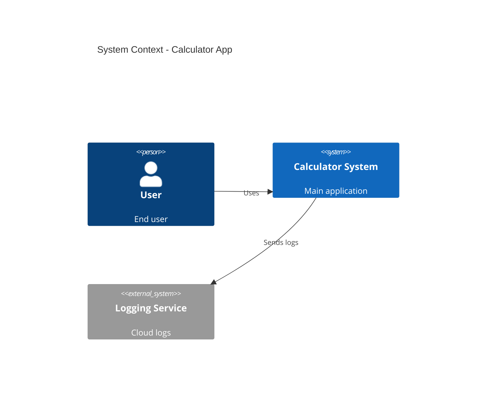
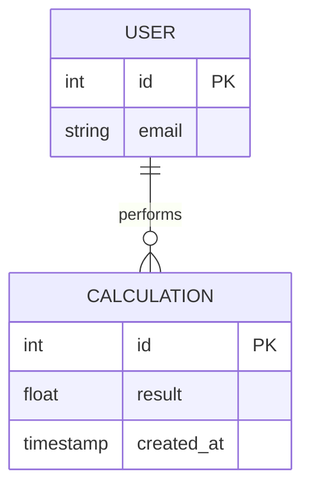

# Multi-Diagram Architecture System - Analysis & Implementation Plan

**Date:** January 22, 2026  
**Status:** 📋 Design Phase - Ready for Implementation  
**Research Grade:** Novel Multi-View Architecture Documentation System

---

## 1. Current Limitations Analysis

### What We Have Now ❌
- **Single Generic Diagram**: One "architecture.mmd" showing basic module relationships
- **No Separation of Concerns**: Structure, behavior, and data flow all mixed
- **Limited Perspective**: Only shows "what exists" not "how it works"
- **Simple GPT Wrapper**: Could be replicated with basic prompt engineering
- **No Depth**: Flat view, no hierarchical drilling
- **Research Weakness**: Not differentiated from existing tools

### Why This Is Insufficient
1. **Developer Understanding**: Cannot understand system behavior from structure alone
2. **Multiple Stakeholders**: Different diagrams needed for architects vs developers vs ops
3. **Complexity Handling**: Large codebases need multiple views at different abstraction levels
4. **Research Contribution**: No novel methodology demonstrated

---

## 2. Research Novelty - What Makes This Strong

### Core Novel Contributions

#### 2.1 **Intelligent Diagram Selection** 🎯
**Innovation:** LLM analyzes codebase and automatically determines which diagram types are most valuable

**Examples:**
- Python Django app → Component, Sequence, Deployment, ER diagrams
- React library → Component, Class, Module diagrams
- Microservices → Container, Deployment, Sequence, API diagrams
- CLI tool → Activity, Class, State Machine diagrams

**Research Value:** Context-aware documentation generation (not just blind template filling)

#### 2.2 **Multi-View Architectural Documentation** 🏗️
**Innovation:** Generate complete architectural picture following established frameworks (4+1 View, C4 Model)

**Standard Views:**
1. **Logical View** → Class diagrams, Component diagrams
2. **Process View** → Sequence diagrams, Activity diagrams
3. **Development View** → Package diagrams, Module diagrams
4. **Physical View** → Deployment diagrams
5. **Scenarios** → Use case diagrams, Sequence diagrams

**Research Value:** Comprehensive coverage vs. single-view approaches

#### 2.3 **Hierarchical Depth with C4 Model** 📊
**Innovation:** Generate diagrams at multiple abstraction levels

**C4 Levels:**
- **Level 1 - System Context**: External dependencies, users, systems
- **Level 2 - Container**: High-level technology containers (web app, database, services)
- **Level 3 - Component**: Internal components within containers
- **Level 4 - Code**: Class-level details (optional, for critical components)

**Research Value:** Scalable documentation for codebases of any size

#### 2.4 **Specialized RAG Prompting per Diagram** 🧠
**Innovation:** Different context extraction and prompt engineering for each diagram type

**Examples:**
- **Class Diagram**: Focus on inheritance, composition, interfaces
- **Sequence Diagram**: Trace function calls, extract execution flows
- **Deployment Diagram**: Parse Docker files, config files, infrastructure code

**Research Value:** Purpose-built context vs. generic code dumping

#### 2.5 **Diagram Validation & Quality Metrics** ✅
**Innovation:** Automated assessment of diagram quality and completeness

**Metrics:**
- **Completeness**: Are all major components represented?
- **Correctness**: Do relationships match actual code?
- **Clarity**: Is the diagram readable and well-organized?
- **Relevance**: Does this diagram add value?

**Research Value:** Measurable quality assessment (C_Diag metric in thesis)

---

## 3. Proposed Diagram Suite

### 3.1 Structural Diagrams (What exists)

#### A. **Component Diagram** 🧩
**Purpose:** High-level system decomposition  
**Mermaid Type:** `graph TD` or `C4Component`  
**When Generated:** Always (replaces current generic diagram)  
**Content:**
- Major modules/components
- Dependencies between components
- External systems
- Interfaces/APIs

**Example:**


#### B. **Class Diagram** 📐
**Purpose:** OOP structure and relationships  
**Mermaid Type:** `classDiagram`  
**When Generated:** If OOP language (Python classes, TypeScript classes, Java)  
**Content:**
- Key classes
- Inheritance hierarchies
- Composition/aggregation
- Methods and attributes (high-level)

**Example:**


#### C. **Package/Module Diagram** 📦
**Purpose:** Code organization structure  
**Mermaid Type:** `graph LR`  
**When Generated:** If >5 modules/packages  
**Content:**
- Package hierarchy
- Module dependencies
- Import relationships

---

### 3.2 Behavioral Diagrams (How it works)

#### D. **Sequence Diagram** 🔄
**Purpose:** Key interaction flows  
**Mermaid Type:** `sequenceDiagram`  
**When Generated:** Always (1-3 critical scenarios)  
**Content:**
- User/system interactions
- Function call sequences
- Async operations
- Error flows

**Example:**


#### E. **Activity Diagram** ⚡
**Purpose:** Workflow/algorithm visualization  
**Mermaid Type:** `flowchart TD`  
**When Generated:** If complex business logic or algorithms  
**Content:**
- Process steps
- Decision points
- Parallel activities
- Error handling

#### F. **State Machine Diagram** 🔀
**Purpose:** State transitions  
**Mermaid Type:** `stateDiagram-v2`  
**When Generated:** If stateful components detected  
**Content:**
- States
- Transitions
- Events/triggers

**Example:**


---

### 3.3 Architectural Views (System context)

#### G. **C4 System Context** 🌍
**Purpose:** System boundaries and external dependencies  
**Mermaid Type:** `C4Context` or `graph TB`  
**When Generated:** Always  
**Content:**
- System under documentation
- Users/actors
- External systems
- Boundaries

**Example:**


#### H. **C4 Container Diagram** 📦
**Purpose:** High-level technology architecture  
**Mermaid Type:** `C4Container`  
**When Generated:** If >2 distinct technical components  
**Content:**
- Web apps, APIs, databases
- Technology stack
- Communication protocols

#### I. **Deployment Diagram** 🚀
**Purpose:** Infrastructure and deployment  
**Mermaid Type:** `graph TB`  
**When Generated:** If Docker/K8s/deployment configs found  
**Content:**
- Servers/containers
- Networks
- Deployment units

---

### 3.4 Data Flow Diagrams

#### J. **Data Flow Diagram (DFD)** 💾
**Purpose:** Data movement through system  
**Mermaid Type:** `flowchart LR`  
**When Generated:** If data processing detected  
**Content:**
- Data sources
- Processing steps
- Data stores
- Data sinks

#### K. **Entity Relationship Diagram** 🗄️
**Purpose:** Database schema  
**Mermaid Type:** `erDiagram`  
**When Generated:** If ORM models or database schemas found  
**Content:**
- Entities
- Relationships
- Key attributes

**Example:**


---

## 4. Implementation Architecture

### 4.1 System Design Overview

```
┌─────────────────────────────────────────────────────────┐
│ Codebase Analysis Phase                                  │
├─────────────────────────────────────────────────────────┤
│ 1. Parse codebase (existing)                            │
│ 2. Build dependency graph (existing)                    │
│ 3. NEW: Detect codebase characteristics                 │
│    - Language features (OOP, functional, async)         │
│    - Frameworks (Django, React, Flask, Express)         │
│    - Infrastructure (Docker, K8s configs)               │
│    - Database models (ORM, SQL schemas)                 │
│    - Complexity metrics (LoC, depth, coupling)          │
└─────────────────────────────────────────────────────────┘
                            ↓
┌─────────────────────────────────────────────────────────┐
│ Diagram Selection Phase (NEW)                           │
├─────────────────────────────────────────────────────────┤
│ LLM Agent: "Diagram Selector"                           │
│                                                          │
│ Input: Codebase characteristics + dependency graph      │
│ Output: List of recommended diagrams with priority      │
│                                                          │
│ Example Output:                                          │
│ [                                                        │
│   {type: "component", priority: "high", reason: "..."}  │
│   {type: "sequence", priority: "high", scenarios: [...]}│
│   {type: "class", priority: "medium", reason: "..."}    │
│   {type: "deployment", priority: "low", reason: "..."}  │
│ ]                                                        │
└─────────────────────────────────────────────────────────┘
                            ↓
┌─────────────────────────────────────────────────────────┐
│ Multi-Diagram Generation Phase (NEW)                    │
├─────────────────────────────────────────────────────────┤
│ For each recommended diagram:                           │
│                                                          │
│ 1. Context Extractor (diagram-specific)                 │
│    - Component → module structure                       │
│    - Sequence → function call traces                    │
│    - Class → OOP relationships                          │
│    - Deployment → config files                          │
│                                                          │
│ 2. Specialized Prompt Curator                           │
│    - Load diagram-specific system prompt                │
│    - Inject tailored context                            │
│    - Add diagram type examples                          │
│                                                          │
│ 3. LLM Generation (per diagram)                         │
│    - Generate Mermaid code for specific diagram type    │
│    - Validate syntax                                    │
│    - Assess quality                                     │
│                                                          │
│ 4. Render to PNG/SVG                                    │
│    - Multiple diagram files                             │
│    - Consistent naming convention                       │
└─────────────────────────────────────────────────────────┘
                            ↓
┌─────────────────────────────────────────────────────────┐
│ Documentation Synthesis Phase (Enhanced)                │
├─────────────────────────────────────────────────────────┤
│ 1. Generate comprehensive README                        │
│    - Overview section                                   │
│    - Diagram index with thumbnails                      │
│    - Explanation of each diagram's purpose              │
│    - Navigation between related diagrams                │
│                                                          │
│ 2. Create diagram-specific documentation                │
│    - One markdown file per major diagram                │
│    - Context and interpretation guide                   │
│    - Related code references                            │
│                                                          │
│ 3. Generate INDEX with diagram catalog                  │
│    - Categorized by type                                │
│    - Quick access links                                 │
│    - Quality metrics per diagram                        │
└─────────────────────────────────────────────────────────┘
```

### 4.2 File Structure (New)

```
docs/arch/v1.0.0_timestamp_hash/
├── README.md                                # Master documentation
├── INDEX.md                                 # Diagram catalog
│
├── diagrams/
│   ├── structural/
│   │   ├── component-diagram.png/svg/mmd   # High-level components
│   │   ├── class-diagram.png/svg/mmd       # OOP structure
│   │   └── module-diagram.png/svg/mmd      # Package organization
│   │
│   ├── behavioral/
│   │   ├── sequence-user-flow.png/svg/mmd  # User interaction
│   │   ├── sequence-data-flow.png/svg/mmd  # Data processing
│   │   ├── activity-main-flow.png/svg/mmd  # Workflow
│   │   └── state-machine.png/svg/mmd       # State transitions
│   │
│   ├── architectural/
│   │   ├── c4-context.png/svg/mmd          # System context
│   │   ├── c4-container.png/svg/mmd        # Container view
│   │   └── deployment.png/svg/mmd          # Infrastructure
│   │
│   └── data/
│       ├── data-flow.png/svg/mmd           # Data movement
│       └── er-diagram.png/svg/mmd          # Database schema
│
├── docs/
│   ├── structural-diagrams.md              # Detailed guide
│   ├── behavioral-diagrams.md              # Interaction guide
│   ├── architectural-diagrams.md           # System guide
│   └── data-diagrams.md                    # Data guide
│
└── metadata/
    ├── generation_info.json                # Overall metrics
    ├── diagram_selection.json              # Why these diagrams?
    └── quality_assessment.json             # Per-diagram quality scores
```

---

## 5. Implementation Phases

### Phase 1: Foundation (Week 1) 🏗️

#### 1.1 Codebase Analyzer Enhancement
**File:** `backend/src/analyzer/codebase_analyzer.py` (NEW)

**Features:**
- Detect language features (async, OOP, functional)
- Identify frameworks (parse imports, config files)
- Find infrastructure (Docker, K8s, cloud configs)
- Locate database models (ORM classes, SQL files)
- Calculate complexity metrics

**Output:** `CodebaseProfile` object
```python
{
    "language": "python",
    "features": ["async", "oop", "type_hints"],
    "frameworks": ["fastapi", "sqlalchemy"],
    "has_database": True,
    "has_deployment_configs": True,
    "complexity": {
        "total_files": 45,
        "total_classes": 23,
        "avg_depth": 3.2,
        "coupling_score": 0.65
    },
    "architectural_patterns": ["mvc", "repository"]
}
```

#### 1.2 Diagram Type Registry
**File:** `backend/src/diagram/diagram_types.py` (NEW)

**Defines:**
- All supported diagram types
- When each should be generated
- Required input context
- Quality validation rules

```python
DIAGRAM_TYPES = {
    "component": {
        "name": "Component Diagram",
        "category": "structural",
        "priority_rules": lambda profile: "high",  # Always high
        "required_context": ["modules", "dependencies"],
        "mermaid_type": "graph TD"
    },
    "sequence": {
        "name": "Sequence Diagram",
        "category": "behavioral",
        "priority_rules": lambda profile: "high" if profile.has_api else "medium",
        "required_context": ["function_calls", "interactions"],
        "mermaid_type": "sequenceDiagram"
    },
    # ... more types
}
```

#### 1.3 Diagram Selector (LLM Agent)
**File:** `backend/src/diagram/diagram_selector.py` (NEW)

**Input:** CodebaseProfile  
**Output:** List of recommended diagrams with priorities

```python
recommended_diagrams = [
    {
        "type": "component",
        "priority": "high",
        "reason": "Essential for understanding system structure",
        "estimated_complexity": "medium"
    },
    {
        "type": "sequence",
        "priority": "high",
        "scenarios": ["user_authentication", "data_processing"],
        "reason": "API-heavy codebase with clear interaction patterns"
    },
    {
        "type": "class",
        "priority": "medium",
        "reason": "OOP design with 23 classes",
        "focus_areas": ["core_models", "services"]
    }
]
```

---

### Phase 2: Multi-Diagram Generation (Week 2) 🎨

#### 2.1 Context Extractors (Specialized)
**File:** `backend/src/diagram/context_extractors.py` (NEW)

**One extractor per diagram type:**

```python
class ComponentContextExtractor:
    def extract(self, dependency_graph, profile):
        return {
            "modules": [...],
            "dependencies": [...],
            "external_systems": [...]
        }

class SequenceContextExtractor:
    def extract(self, dependency_graph, profile, scenario):
        # Trace function calls for specific scenario
        return {
            "actors": [...],
            "interactions": [...],
            "flow": [...]
        }

class ClassContextExtractor:
    def extract(self, dependency_graph, profile):
        # Extract OOP relationships
        return {
            "classes": [...],
            "inheritance": [...],
            "compositions": [...]
        }
```

#### 2.2 Specialized Prompt Library
**File:** `backend/src/llm/prompts/` (NEW DIRECTORY)

**Files:**
- `component_diagram.txt` - System prompt for component diagrams
- `sequence_diagram.txt` - System prompt for sequence diagrams
- `class_diagram.txt` - System prompt for class diagrams
- etc.

**Example:** `sequence_diagram.txt`
```
You are an expert software architect specializing in interaction design.

Your task is to generate a Mermaid sequence diagram showing the execution flow for: {scenario}

Context provided:
- Function call traces
- Actor interactions
- Data flow

Requirements:
1. Use sequenceDiagram syntax
2. Show key participants (users, services, systems)
3. Include important messages/calls
4. Add alt/opt blocks for conditionals
5. Keep it focused (max 15 interactions)
6. Add notes for complex operations

Output ONLY the mermaid code, no explanations.
```

#### 2.3 Diagram Generator Orchestrator
**File:** `backend/src/diagram/multi_diagram_generator.py` (NEW)

```python
class MultiDiagramGenerator:
    def generate_all(self, codebase_profile, dependency_graph, selected_diagrams):
        results = {}
        
        for diagram_spec in selected_diagrams:
            diagram_type = diagram_spec['type']
            
            # 1. Extract context
            context = self.extract_context(diagram_type, dependency_graph, profile)
            
            # 2. Load specialized prompt
            prompt = self.load_prompt(diagram_type)
            
            # 3. Generate with LLM
            mermaid_code = self.llm_client.generate(prompt, context)
            
            # 4. Validate
            is_valid, quality_score = self.validate_diagram(mermaid_code, diagram_type)
            
            results[diagram_type] = {
                "code": mermaid_code,
                "valid": is_valid,
                "quality": quality_score,
                "metadata": diagram_spec
            }
        
        return results
```

---

### Phase 3: Enhanced Documentation (Week 3) 📚

#### 3.1 Master README Generator
**File:** `backend/src/output/documentation_synthesizer.py` (NEW)

**Generates:**
```markdown
# Architecture Documentation

## Overview
[Generated architectural overview]

## Architecture Views

### 🏗️ Structural View
Understand the system's organization and structure.

**Component Diagram**  


This diagram shows the high-level decomposition of the system into major components...
[More details](docs/structural-diagrams.md#component-diagram)

**Class Diagram**  


Object-oriented structure showing key classes and their relationships...
[More details](docs/structural-diagrams.md#class-diagram)

### 🔄 Behavioral View
See how the system behaves and processes information.

**Sequence Diagram: User Authentication**  


Step-by-step flow showing user authentication process...

**Sequence Diagram: Data Processing**  


...

### 🌍 Architectural View
System context and deployment.

**C4 System Context**  


### 💾 Data View
Data structures and flow.

**Entity Relationship Diagram**  


## Navigation Guide

- **New Developer?** Start with Component Diagram → Class Diagram
- **Understanding Behavior?** See Sequence Diagrams → Activity Diagrams
- **Deployment/Ops?** See Deployment Diagram → Container Diagram
- **Database Work?** See ER Diagram → Data Flow Diagram

## Diagram Index

| Diagram | Type | Purpose | Quality Score |
|---------|------|---------|---------------|
| Component | Structural | System decomposition | 9.2/10 |
| Sequence: Auth | Behavioral | User flows | 8.7/10 |
| Class | Structural | OOP design | 8.5/10 |
| ... | ... | ... | ... |
```

#### 3.2 Per-Category Documentation
**Files:** `docs/structural-diagrams.md`, `docs/behavioral-diagrams.md`, etc.

**Deep dive into each diagram with:**
- Larger embedded images
- Detailed explanations
- Code references
- Design decisions
- Related diagrams

---

### Phase 4: Quality & Validation (Week 4) ✅

#### 4.1 Diagram Quality Assessor
**File:** `backend/src/validation/diagram_validator.py` (NEW)

**Per-diagram validation:**
```python
class DiagramValidator:
    def assess_quality(self, diagram_code, diagram_type, context):
        scores = {
            "syntax_valid": self.check_syntax(diagram_code),
            "completeness": self.check_completeness(diagram_code, context),
            "clarity": self.check_clarity(diagram_code),
            "accuracy": self.check_accuracy(diagram_code, context),
            "relevance": self.check_relevance(diagram_code, diagram_type)
        }
        
        overall_score = sum(scores.values()) / len(scores)
        
        return {
            "overall": overall_score,
            "details": scores,
            "issues": self.identify_issues(scores),
            "recommendations": self.suggest_improvements(scores)
        }
```

**Metrics Tracked:**
- **Syntax Valid**: Mermaid parses correctly
- **Completeness**: All major components/flows represented
- **Clarity**: Readable layout, proper naming
- **Accuracy**: Matches actual code structure
- **Relevance**: Adds value to documentation

#### 4.2 Metadata Enhancement
**File:** `metadata/diagram_selection.json`

```json
{
  "generated_diagrams": [
    {
      "type": "component",
      "category": "structural",
      "reason": "Essential system decomposition",
      "priority": "high",
      "generation_time": 45.2,
      "quality_score": 9.2,
      "validation": {
        "syntax_valid": true,
        "completeness": 0.95,
        "clarity": 0.90,
        "accuracy": 0.92
      }
    },
    {
      "type": "sequence",
      "category": "behavioral",
      "scenario": "user_authentication",
      "reason": "Critical user flow in API-centric app",
      "priority": "high",
      "generation_time": 52.1,
      "quality_score": 8.7
    }
  ],
  "diagrams_skipped": [
    {
      "type": "state_machine",
      "reason": "No stateful components detected",
      "priority": "low"
    }
  ],
  "total_generation_time": 287.3,
  "llm_calls": 6
}
```

---

## 6. Research Contributions Summary

### 6.1 Novel Methodologies

| Contribution | Description | Research Value |
|--------------|-------------|----------------|
| **Intelligent Diagram Selection** | LLM-based analysis to determine relevant diagrams | Context-aware automation |
| **Multi-View Architecture** | Complete architectural documentation (4+1 views) | Comprehensive coverage |
| **Hierarchical C4 Implementation** | Generate diagrams at multiple abstraction levels | Scalability |
| **Specialized RAG per Diagram** | Context extraction tailored to each diagram type | Precision over generality |
| **Automated Quality Assessment** | Per-diagram validation and scoring | Measurable outcomes |
| **Diagram Relationship Mapping** | Cross-references between related diagrams | Navigation & understanding |

### 6.2 Comparison with Existing Tools

| Feature | Simple GPT Wrapper | Our System |
|---------|-------------------|------------|
| Diagram Types | 1 (generic) | 6-10 (specialized) |
| Context Awareness | None | Codebase analysis |
| Diagram Selection | Manual | Automated LLM agent |
| Quality Validation | None | Multi-metric assessment |
| Hierarchical Views | No | C4 Model levels |
| Documentation | Basic | Comprehensive + guides |
| Research Novelty | ❌ Low | ✅ High |

### 6.3 Thesis Metrics Enhancement

**Current Metrics:**
- T_LLM: Time spent in LLM
- C_Arch: Quality of documentation
- F_Diag: Diagram correctness

**New Metrics:**
- **D_Coverage**: % of relevant diagram types generated
- **D_Quality**: Per-diagram quality scores
- **D_Relevance**: Precision of diagram selection
- **T_Understanding**: Time to understand codebase (user study)
- **C_Navigation**: Ease of navigating multi-diagram docs

---

## 7. Implementation Timeline

### Week 1: Foundation
- [ ] Codebase analyzer (detect features, frameworks)
- [ ] Diagram type registry
- [ ] Diagram selector (LLM agent)
- [ ] Update pipeline to use new analyzer

### Week 2: Generation
- [ ] Context extractors (per diagram type)
- [ ] Specialized prompt library
- [ ] Multi-diagram generator
- [ ] Parallel/sequential LLM calls

### Week 3: Documentation
- [ ] Master README generator
- [ ] Per-category documentation
- [ ] Diagram relationship mapping
- [ ] Enhanced INDEX with catalog

### Week 4: Quality & Testing
- [ ] Diagram validator
- [ ] Quality assessment system
- [ ] Metadata enhancement
- [ ] End-to-end testing on diverse codebases

### Week 5: Research Validation
- [ ] Case studies (5-10 repos)
- [ ] Metrics collection
- [ ] User studies (developers)
- [ ] Comparison with existing tools

---

## 8. Technical Specifications

### 8.1 LLM Call Strategy

**Option A: Sequential (Safe)**
- Generate diagrams one by one
- ~60s per diagram
- Total: 6-10 diagrams = 6-10 minutes
- Pros: Reliable, debuggable
- Cons: Slower

**Option B: Parallel (Fast)**
- Generate multiple diagrams concurrently
- ~60s total (limited by slowest)
- Pros: Much faster
- Cons: Higher API load, potential rate limits

**Recommendation:** Hybrid
- High priority diagrams: Sequential
- Medium/low priority: Parallel batch

### 8.2 Token Budget Management

**Current:** ~4K tokens per diagram  
**With 8 diagrams:** ~32K tokens total

**Strategy:**
- Use smaller context for simpler diagrams
- Share common context (codebase overview)
- Cache parsed data between calls

### 8.3 Rendering Performance

**Current:** ~80s per PNG rendering  
**With 8 diagrams:** ~640s (10+ minutes)

**Optimization:**
- Parallel rendering (Puppeteer pool)
- Optional: Generate PNGs on-demand
- Priority: Render only high-priority diagrams immediately

---

## 9. User Experience Flow

```
Developer → Generate Architecture Docs
    ↓
System analyzes codebase (20s)
    ↓
System selects 6-8 relevant diagrams
    ↓
Progress: "Generating Component Diagram (1/8)..."
Progress: "Generating Sequence Diagram - Auth (2/8)..."
Progress: "Generating Class Diagram (3/8)..."
    ...
    ↓
Generated in 8 minutes (was 4 minutes, but 8x more comprehensive)
    ↓
Developer views README with diagram gallery
    ↓
Developer clicks "Component Diagram" → Opens with context
    ↓
README suggests: "Next: See Sequence Diagram for behavior"
    ↓
Developer gains comprehensive understanding
```

---

## 10. Expected Outcomes

### For Research Paper
✅ **Novel contribution** - Not just another GPT wrapper  
✅ **Measurable metrics** - Diagram quality, coverage, selection accuracy  
✅ **Comprehensive methodology** - Multi-view architecture approach  
✅ **Scalable solution** - Works for codebases of any size  
✅ **Validated approach** - Quality assessment framework

### For Developers
✅ **Complete picture** - Structure + behavior + deployment  
✅ **Easy navigation** - Organized by concern  
✅ **Context-aware** - Only relevant diagrams generated  
✅ **Professional output** - Publication-ready documentation  
✅ **Time-saving** - Automated multi-diagram generation

### For Stakeholders
✅ **Architects** - High-level views (C4 context/container)  
✅ **Developers** - Detailed views (class, sequence)  
✅ **DevOps** - Deployment views (infrastructure)  
✅ **Managers** - System overview (component)

---

## 11. Risk Mitigation

### Risk 1: LLM Generation Time
**Issue:** 8 diagrams × 60s = 8 minutes  
**Mitigation:** 
- Parallel generation for medium/low priority
- Progressive generation (show diagrams as ready)
- Cache and reuse for unchanged code

### Risk 2: Diagram Quality Variance
**Issue:** Some diagrams may be low quality  
**Mitigation:**
- Automated validation
- Retry with refined prompts
- Human-in-loop for critical diagrams

### Risk 3: Context Overload
**Issue:** Too much information to digest  
**Mitigation:**
- Clear categorization
- Navigation guide in README
- Progressive disclosure (overview → details)

### Risk 4: Complexity for Simple Projects
**Issue:** Small repos don't need 8 diagrams  
**Mitigation:**
- Intelligent diagram selection
- Minimum threshold (e.g., >5 files for class diagram)
- User override option

---

## 12. Conclusion & Next Steps

### This Design Addresses:
✅ **"Simple architecture diagram cannot satisfy"** → Multi-view approach  
✅ **"Entire repo understanding"** → Comprehensive coverage  
✅ **"Strong novel plugin"** → Research-grade methodology  
✅ **"Not just GPT wrapper"** → Intelligent selection + specialized generation  

### Immediate Action Items:

1. **Review & Approve Design** (You)
   - Confirm diagram types to implement
   - Prioritize features
   - Set timeline

2. **Phase 1 Implementation** (Week 1)
   - Build codebase analyzer
   - Create diagram selector
   - Test on test-repo

3. **Validate Approach** (Ongoing)
   - Generate sample multi-diagram docs
   - Get feedback
   - Iterate on quality

### Research Impact:
This transforms the project from a "tool" to a "research contribution" with:
- Novel automated diagram selection methodology
- Multi-view architecture documentation framework
- Quality assessment and validation system
- Measurable research metrics

**Ready to implement when approved!** 🚀
