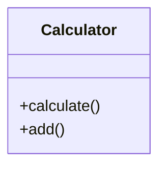

# Phase 3 Implementation Plan

**Date:** January 22, 2026  
**Status:** Planning  
**Prerequisites:** Phase 1 ✅ + Phase 2 ✅ Complete

---

## Overview

Phase 3 focuses on **Enhanced Documentation & Quality Validation** - transforming raw multi-diagram output into professional, interconnected documentation with automated quality assurance.

---

## Goals

1. **Cross-Diagram Relationships** - Map connections between diagrams
2. **Enhanced Navigation** - Interactive links between related diagrams
3. **Quality Validation** - Automated diagram quality assessment
4. **Documentation Polish** - Professional formatting and organization

---

## Components to Build

### 1. Diagram Relationship Mapper
**File:** `backend/src/diagram/relationship_mapper.py`

**Purpose:** Analyze generated diagrams to find cross-references and relationships

**Features:**
- Detect shared entities across diagrams (e.g., same class in Class + Sequence)
- Map data flow connections (ER → Data Flow → Sequence)
- Identify component-class mappings (Component → Class)
- Build relationship graph between diagrams

**Example Output:**
```python
{
  'component → class': [
    {'component': 'Calculator', 'classes': ['Calculator', 'Operation']}
  ],
  'class → sequence': [
    {'class': 'Calculator', 'sequences': ['calculate_operation']}
  ],
  'er_diagram → data_flow': [
    {'entity': 'User', 'data_flows': ['user_input_processing']}
  ]
}
```

### 2. Diagram Quality Validator
**File:** `backend/src/validation/diagram_validator.py`

**Purpose:** Comprehensive quality assessment for each diagram

**Validation Rules:**

**Per Diagram Type:**
- **Component:** Has external dependencies, clear module boundaries
- **Class:** Valid UML notation, proper visibility, relationships exist
- **Sequence:** Has actors, chronological flow, return messages
- **Activity:** Has start/end, decision diamonds, clear flow
- **Data Flow:** Has sources, transformations, sinks
- **C4 Context:** Has users, system, external systems
- **ER Diagram:** Has entities, attributes, proper cardinality

**Quality Metrics:**
- **Syntax Score** (0-100): Mermaid syntax correctness
- **Completeness Score** (0-100): Has all required elements
- **Clarity Score** (0-100): Readable, not too complex
- **Accuracy Score** (0-100): Matches codebase reality

**Aggregate Quality:**
```python
{
  'diagram_type': 'class',
  'scores': {
    'syntax': 95,
    'completeness': 85,
    'clarity': 90,
    'accuracy': 80
  },
  'overall': 87.5,
  'issues': ['Missing return types on 2 methods'],
  'recommendations': ['Add type annotations', 'Simplify inheritance']
}
```

### 3. Interactive Documentation Generator
**File:** `backend/src/output/interactive_docs.py`

**Purpose:** Generate enhanced documentation with cross-references

**Features:**

**Enhanced README:**
```markdown
# Architecture Documentation

## Quick Navigation
- [System Overview](#overview)
- [Structural View](#structural)
  - [Component Diagram](#component) → See related [Class Diagram](#class)
  - [Class Diagram](#class) → Used in [Sequence Diagram](#sequence)
- [Behavioral View](#behavioral)
  - [Sequence Diagram](#sequence) → Interacts with [Component](#component)
  - [Activity Diagram](#activity) → Processes [Data Flow](#data-flow)
```

**Diagram Cross-Reference Section:**
```markdown
## Component Diagram


**Related Diagrams:**
- [Class Diagram](diagrams/class.png) - Shows internal structure of `Calculator` component
- [Sequence Diagram](diagrams/sequence.png) - Shows how components interact
- [Data Flow](diagrams/data_flow.png) - Shows data moving through components
```

### 4. Diagram Comparison View
**File:** `backend/src/output/diagram_comparisons.py`

**Purpose:** Generate comparison documentation

**Comparisons:**
- **Before/After** (for version comparisons)
- **High-Level vs Detail** (C4 Context → C4 Container → Component)
- **Structure vs Behavior** (Class → Sequence)
- **Static vs Dynamic** (Component → Activity)

**Output:** `docs/diagram-comparisons.md`

### 5. Quality Report Generator
**File:** `backend/src/validation/quality_report.py`

**Purpose:** Generate comprehensive quality report

**Report Sections:**
1. **Executive Summary** - Overall quality score, diagram count
2. **Per-Diagram Scores** - Table with all quality metrics
3. **Issues Found** - Grouped by severity (critical, warning, info)
4. **Recommendations** - Actionable improvements
5. **Coverage Analysis** - Which aspects are well-documented vs missing

**Output:** `QUALITY_REPORT.md`

---

## Updated Pipeline (9 Stages)

**Stage 1-8:** (Existing from Phase 2)

**Stage 9: Quality & Enhancement** (NEW)
```python
# 9a. Validate diagram quality
validator = DiagramValidator()
quality_results = validator.validate_all(diagram_results)

# 9b. Map cross-diagram relationships
mapper = RelationshipMapper()
relationships = mapper.map_relationships(diagram_results, quality_results)

# 9c. Generate enhanced documentation
interactive_docs = InteractiveDocsGenerator()
enhanced_readme = interactive_docs.generate(
    diagram_results,
    relationships,
    quality_results
)

# 9d. Generate quality report
report_generator = QualityReportGenerator()
quality_report = report_generator.generate(quality_results, relationships)

# 9e. Save enhanced outputs
organizer.save_enhanced_documentation(
    output_dir,
    enhanced_readme,
    relationships,
    quality_report
)
```

---

## Enhanced Output Structure

```
v1.0.0_2026-01-22_abc123f/
├── README.md                     # Enhanced with cross-references
├── INDEX.md                      # Updated with quality scores
├── QUALITY_REPORT.md             # NEW: Comprehensive quality analysis
├── diagrams/
│   ├── component.mmd/.png/.svg
│   ├── class.mmd/.png/.svg
│   └── ... (all diagrams)
├── docs/
│   ├── structural-diagrams.md
│   ├── behavioral-diagrams.md
│   ├── data-diagrams.md
│   ├── diagram-relationships.md  # NEW: Cross-diagram mapping
│   └── diagram-comparisons.md    # NEW: Comparison views
├── metadata/
│   ├── generation_info.json
│   ├── quality_scores.json       # NEW: Quality metrics
│   └── relationships.json        # NEW: Diagram relationships
└── validation/
    ├── syntax_check.log          # NEW: Syntax validation log
    └── recommendations.md        # NEW: Improvement suggestions
```

---

## Implementation Order

### Step 1: Diagram Quality Validator (High Priority)
**Why First:** Quality validation is most critical, provides immediate value

**Tasks:**
1. Create `DiagramValidator` base class
2. Implement per-diagram-type validation rules
3. Add quality scoring system
4. Generate validation reports

**Time Estimate:** 45 minutes

### Step 2: Quality Report Generator (High Priority)
**Why Second:** Complements validator, provides actionable insights

**Tasks:**
1. Create `QualityReportGenerator`
2. Aggregate validation results
3. Generate recommendations
4. Format as markdown

**Time Estimate:** 30 minutes

### Step 3: Relationship Mapper (Medium Priority)
**Why Third:** Enhances documentation, not critical for basic function

**Tasks:**
1. Create `RelationshipMapper`
2. Analyze diagram content for shared entities
3. Build relationship graph
4. Generate relationship documentation

**Time Estimate:** 60 minutes

### Step 4: Interactive Documentation (Low Priority)
**Why Last:** Polish and enhancement, basic docs already work

**Tasks:**
1. Create `InteractiveDocsGenerator`
2. Enhance README with cross-references
3. Add navigation improvements
4. Generate comparison views

**Time Estimate:** 45 minutes

---

## Phase 3 Success Criteria

**Must Have:**
- [ ] Diagram quality validation (all 10 diagram types)
- [ ] Quality scores (0-100) for each diagram
- [ ] Comprehensive quality report (QUALITY_REPORT.md)
- [ ] Validation integrated into pipeline

**Should Have:**
- [ ] Cross-diagram relationship mapping
- [ ] Enhanced README with cross-references
- [ ] Relationship documentation (diagram-relationships.md)

**Nice to Have:**
- [ ] Diagram comparisons (before/after, high-level vs detail)
- [ ] Interactive navigation
- [ ] Visual relationship graph

---

## Testing Strategy

### Unit Tests
- Test each validation rule individually
- Test quality scoring accuracy
- Test relationship detection

### Integration Tests
- Run full pipeline with validation
- Verify quality reports generated
- Check cross-references are accurate

### Quality Tests
- Validate validation rules catch real issues
- Check quality scores are reasonable
- Verify recommendations are actionable

---

## Example: Quality Validation Flow

**Input:** Generated class diagram (from Phase 2)



**Validation:**
```python
validator = DiagramValidator()
result = validator.validate('class', mermaid_code)

# Output:
{
  'syntax': 95,          # Valid Mermaid
  'completeness': 60,    # Missing attributes, method params
  'clarity': 80,         # Simple, readable
  'accuracy': 70,        # Matches code but incomplete
  'overall': 76.25,
  'issues': [
    'Missing method parameters',
    'No attributes defined',
    'Missing return types'
  ],
  'recommendations': [
    'Add method signatures: +calculate(a: int, b: int): int',
    'Include class attributes if any exist',
    'Add visibility modifiers for internal methods'
  ]
}
```

**Enhanced Documentation:**
```markdown
## Class Diagram


**Quality Score:** 76/100 ⚠️

**Issues:**
- Missing method parameters
- No attributes defined

**Recommendations:**
- Add method signatures for clarity
- Include class attributes

**Related Diagrams:**
- [Component Diagram](diagrams/component.png) - `Calculator` is part of `math` component
- [Sequence Diagram](diagrams/sequence.png) - See `Calculator.calculate()` interaction
```

---

## Key Decisions

### 1. Validation Approach
**Decision:** Rule-based validation with extensible rule system
**Rationale:** Fast, deterministic, easy to test. Can add LLM-based validation later.

### 2. Quality Scoring
**Decision:** 4-component score (syntax, completeness, clarity, accuracy)
**Rationale:** Comprehensive, interpretable, actionable feedback.

### 3. Relationship Detection
**Decision:** String matching + semantic analysis (entity names, types)
**Rationale:** Simple but effective. Can enhance with NLP later.

### 4. Cross-Reference Format
**Decision:** Markdown links with descriptions
**Rationale:** Works in any markdown viewer, clickable in VS Code, GitHub, etc.

---

## Resources Needed

**Libraries:**
- (Already have) Mermaid CLI for syntax validation
- (Already have) Tree-sitter for AST comparison (accuracy checking)
- (Already have) Python standard library for everything else

**No new dependencies needed!** ✅

---

## Risk Assessment

### High Risk
- **Quality scoring accuracy:** Heuristic-based, may not match human judgment
  - **Mitigation:** Start conservative, tune with feedback

### Medium Risk
- **Relationship detection false positives:** May link unrelated diagrams
  - **Mitigation:** Require multiple signals (name + type + context)

### Low Risk
- **Performance:** Validation adds processing time
  - **Mitigation:** Run in parallel, cache results

---

## Next Action

**Start with Step 1:** Implement Diagram Quality Validator

**Estimated Total Time for Phase 3:** 3-4 hours

**Expected Outcome:** Research-grade documentation with quality assurance and professional cross-referencing

---

*Phase 3 Plan - Ready to Implement - January 22, 2026*
