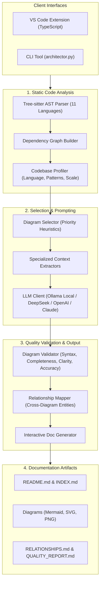

# Architector-LLM: Automated Software Architecture Documentation via Large Language Models

[](https://github.com/engrhammadkhurshid/Architector-LLM)
[](LICENSE)
[](https://nust.edu.pk)
[](https://python.org)
[](https://code.visualstudio.com)
[](https://mermaid.js.org)
[](https://ollama.ai)

> **An intelligent, research-backed system that bridges source code and high-level architectural documentation.** By synthesizing multi-language Abstract Syntax Tree (AST) parsing, static dependency graph profiling, and multi-model Large Language Model (LLM) reasoning, Architector-LLM automatically generates professional, multi-view architecture specifications and quality-validated diagrams.

---

## 📖 Research Publication

**Paper Title:**  
> *"From Code to Architecture: Leveraging LLMs for Automated Software Design Documentation"*

- **Author:** Engr. Hammad Khurshid
- **Institution:** National University of Sciences and Technology (NUST), Islamabad, Pakistan
- **Publication Year:** 2026
- **Status:** Under Review

### Abstract
Manual software architecture documentation is notoriously labor-intensive, rapidly becomes obsolete as codebases evolve (architectural drift/erosion), and is frequently neglected in agile development workflows. This research introduces a hybrid framework combining static Abstract Syntax Tree (AST) parsing, topological dependency graph analysis, and context-tailored Retrieval-Augmented Generation (RAG) with Large Language Models. The framework automatically selects, generates, and validates multi-view architectural specifications—producing structural, behavioral, data, and system context diagrams alongside interactive cross-referenced documentation. Empirical validation across 9 open-source systems demonstrated a **94.7% diagram synthesis success rate** with an average throughput of **284 LOC/second**.

```bibtex
@inproceedings{khurshid2026architector,
  title={From Code to Architecture: Leveraging LLMs for Automated Software Design Documentation},
  author={Khurshid, Hammad},
  booktitle={Under Review},
  year={2026},
  organization={National University of Sciences and Technology (NUST), Pakistan}
}
```

---

## ⚡ Key Capabilities

### 1. Multi-Language Tree-Sitter AST Engine
Extracts deep syntactic metadata—classes, methods, signatures, standalone functions, module imports, and inheritance graphs—across **11 programming languages**:
- **Python**, **JavaScript**, **TypeScript**, **PHP**, **Java**, **C**, **C++**, **C#**, **Go**, **Rust**, and **Ruby**.

### 2. Multi-Diagram Architectural Views
Rather than producing a single generic diagram, Architector-LLM generates a complete suite of **6 specialized architectural views**:
- 🏛️ **System Component Diagram:** Modular structure and third-party dependencies.
- 📐 **Class Diagram:** OOP class hierarchies, attributes, method signatures, and associations.
- ⏱️ **Sequence Diagram:** Chronological interaction protocols and message exchanges.
- 🔄 **Activity Diagram:** Execution workflows, branching decision trees, and business logic paths.
- 🌊 **Data Flow Diagram (DFD):** Input sources, transformations, and persistence sinks.
- 🌐 **C4 System Context Diagram:** System boundaries, user personas, and external system integrations.

### 3. Automated 4-Dimension Diagram Quality Validation
Every generated diagram is evaluated by an automated quality validation engine:
- **Syntax (100-pt scale):** Strict verification of Mermaid grammar and visual delimiters.
- **Completeness:** Verifies that core AST entities and relationships are represented.
- **Clarity:** Density and visual structure assessment to avoid visual spaghetti.
- **Accuracy:** Cross-checks consistency against the static dependency graph.
- Generates a standalone **`QUALITY_REPORT.md`** with actionable architectural recommendations.

### 4. Cross-Diagram Relationship Mapping & Interactive Docs
- **Entity Correlation:** Detects shared components and actors across all diagrams.
- **Cross-Reference Navigation:** Auto-generates **`INDEX.md`** and **`RELATIONSHIPS.md`** for seamless navigation.
- **Architectural Deltas:** Automatically generates **`COMPARISONS.md`** to track architectural drift across Git commits and semantic versions.

### 5. Multi-Provider LLM Integration & Local Privacy
- **Local & Private (Default):** Zero code leaves your machine. Automatically detects local **Ollama** daemons running `deepseek-coder:6.7b` on port 11434.
- **Cloud APIs:** First-class support for **DeepSeek API**, **OpenAI GPT-4**, and **Anthropic Claude** with credentials stored in VS Code's encrypted `SecretStorage`.

### 6. Dual Interfaces: VS Code Extension & Standalone CLI
- **VS Code Extension:** One-click status bar generation, interactive setup wizard, dependency diagnostics, and webview progress panel.
- **CLI Runner:** Execute `python3 architector.py <codebase-path>` in CI/CD pipelines or headless servers.

---

## 🏗️ System Architecture



---

## 📊 Empirical Evaluation & Benchmarks

Architector-LLM was rigorously evaluated across 9 diverse real-world open-source repositories spanning 3 programming languages and 3 scale categories (from small libraries to 112,000+ LOC enterprise frameworks):

| # | Project | LOC | Language | Processing Time | Throughput | Quality Score | Diagrams Synthesized | Status |
|---|---------|-----|----------|-----------------|------------|---------------|----------------------|--------|
| 1 | **Flask-Login** | 599 | Python | 94.2s | 6.4 LOC/s | 79.0 / 100 | 8 / 8 | ✅ Success |
| 2 | **Typer** | 3,981 | Python | 86.2s | 46.2 LOC/s | 70.1 / 100 | 7 / 8 | ✅ Success |
| 3 | **PHP-DI** | 3,162 | PHP | 68.6s | 46.1 LOC/s | 79.7 / 100 | 7 / 7 | ✅ Success |
| 4 | **Slim** | 3,133 | PHP | 55.8s | 56.2 LOC/s | 73.9 / 100 | 6 / 6 | ✅ Success |
| 5 | **Day.js** | 8,031 | JavaScript | 50.5s | 159.0 LOC/s | 74.9 / 100 | 6 / 7 | ✅ Success |
| 6 | **Celery** | 26,726 | Python | 99.0s | 270.0 LOC/s | 78.0 / 100 | 8 / 8 | ✅ Success |
| 7 | **React Hook Form** | 41,806 | TypeScript | 73.3s | 570.2 LOC/s | **85.0 / 100** | 7 / 7 | ✅ Success |
| 8 | **NestJS** | 61,049 | TypeScript | 77.9s | **783.8 LOC/s** | 79.6 / 100 | 8 / 8 | ✅ Success |
| 9 | **Laravel** | 112,126 | PHP | 147.8s | 758.6 LOC/s | 75.2 / 100 | 8 / 8 | ✅ Success |

### Key Benchmark Metrics
- **Total LOC Evaluated:** 260,613 lines of code
- **Documentation Success Rate:** **100%** (9/9 projects documented)
- **Diagram Synthesis Success:** **94.7%** (71 of 75 diagrams generated and verified)
- **Average Processing Speed:** **284.1 LOC/second**
- **Average Quality Score:** **77.3 / 100**
- Complete methodology and raw data: [`docs/benchmarks/FINAL_TEST_REPORT.md`](docs/benchmarks/FINAL_TEST_REPORT.md).

---

## 🚀 Quick Start

### 1. Installation

```bash
# Clone the repository
git clone https://github.com/engrhammadkhurshid/Architector-LLM.git
cd Architector-LLM

# Install extension dependencies
npm install
npm run compile

# Install Python backend dependencies
pip install -r requirements.txt
```

### 2. Configure LLM Provider

#### Option A: Local Ollama (Free, Private, Recommended)
1. Install [Ollama](https://ollama.ai).
2. Pull the model:
   ```bash
   ollama pull deepseek-coder:6.7b
   ```
3. Architector-LLM automatically connects to `http://localhost:11434`.

#### Option B: Cloud Provider
Copy `.env.example` to `.env` and configure your API key:
```bash
cp .env.example .env
# Edit .env and set DEEPSEEK_API_KEY, OPENAI_API_KEY, or CLAUDE_API_KEY
```

### 3. Verify Environment

```bash
python3 tests/test_setup.py
```

---

## 💻 Usage

### Standalone CLI Execution

Generate full architectural documentation directly from your terminal:

```bash
# Analyze any codebase (auto-detects project version from Git or manifests)
python3 architector.py /path/to/your/codebase

# Specify explicit semantic version
python3 architector.py /path/to/your/codebase 2.1.0

# Run on the included sample project:
python3 architector.py test-repo 1.0.0
```

### VS Code Extension Execution

1. Open this repository in VS Code and press **F5** (launches Extension Development Host).
2. Open any codebase workspace in the development window.
3. Click **`$(book) Architector`** in the status bar (bottom right), or press `Cmd+Shift+P` / `Ctrl+Shift+P` and choose:
   ```text
   Architector: Generate Architecture Documentation
   ```
4. Follow the interactive **Progress Panel** webview as the 6 stages complete.
5. Review the resulting documentation directly in VS Code Markdown Preview.

---

## 📂 Generated Documentation Artifacts

Every execution automatically generates an isolated, versioned package inside `docs/arch/`:

```
docs/arch/v1.0.0_2026-01-24-184551_51589c50/
├── README.md               # Executive architecture summary
├── INDEX.md                # Interactive cross-referenced navigation index
├── RELATIONSHIPS.md        # Cross-diagram entity mapping and coverage analysis
├── QUALITY_REPORT.md      # Automated 4-dimension quality scoring report
├── COMPARISONS.md         # Architectural delta against prior version runs
├── diagrams/
│   ├── component.mmd / .svg / .png
│   ├── class.mmd / .svg / .png
│   ├── sequence.mmd / .svg / .png
│   ├── activity.mmd / .svg / .png
│   ├── data_flow.mmd / .svg / .png
│   └── c4_context.mmd / .svg / .png
└── metadata/
    └── generation_info.json # Run telemetry, model, timestamp, and metrics
```

---

## 🧪 Automated Test Suite

Run the comprehensive unit and integration test suite:

```bash
# Run all unit and integration tests via unittest
python3 -m unittest discover tests

# Run specific subsystem tests
python3 tests/test_setup.py          # Environment verification
python3 tests/test_parser.py         # AST parser & dependency graph unit tests
python3 tests/test_analyzer.py       # Codebase analyzer & diagram selector
python3 tests/test_prompts.py        # Context extraction & prompt curation
python3 tests/test_validation.py     # 4-dimension quality scoring
python3 tests/test_relationships.py  # Cross-diagram entity correlation
python3 tests/test_pipeline.py       # End-to-end pipeline on test-repo
python3 tests/test_flask_app.py      # Real-world web app integration

# Run TypeScript extension lint and compile checks
npm run compile
npm run lint
```

---

## 📚 Documentation Index

| Guide | Description |
|-------|-------------|
| [docs/ARCHITECTURE.md](docs/ARCHITECTURE.md) | Technical architecture, pipeline stages, and module deep dive |
| [docs/SETUP.md](docs/SETUP.md) | Comprehensive installation, environment, and provider setup |
| [docs/USAGE.md](docs/USAGE.md) | End-to-end user manual for both VS Code GUI and CLI |
| [docs/DEVELOPMENT.md](docs/DEVELOPMENT.md) | Contributor guide, debugging instructions, and extension architecture |
| [docs/SUPPORTED_LANGUAGES.md](docs/SUPPORTED_LANGUAGES.md) | AST parsing matrix across 11 programming languages |
| [docs/MULTI_DIAGRAM_DESIGN.md](docs/MULTI_DIAGRAM_DESIGN.md) | Design specifications for the 6 architectural diagram views |
| [docs/OLLAMA_AUTO_DETECTION.md](docs/OLLAMA_AUTO_DETECTION.md) | Technical guide for local Ollama auto-detection and troubleshooting |
| [docs/PRIVACY_POLICY.md](docs/PRIVACY_POLICY.md) | GDPR-compliant research consent and privacy policy |
| [docs/ANALYTICS_GUIDE.md](docs/ANALYTICS_GUIDE.md) | Optional research telemetry backend guide and deployment instructions |
| [docs/DISTRIBUTION_GUIDE.md](docs/DISTRIBUTION_GUIDE.md) | Packaging and publishing guide for VS Code Marketplace |
| [docs/benchmarks/FINAL_TEST_REPORT.md](docs/benchmarks/FINAL_TEST_REPORT.md) | Full empirical evaluation results across 9 open-source codebases |
| [docs/research/COMPLETE_TECHNICAL_REPORT.md](docs/research/COMPLETE_TECHNICAL_REPORT.md) | Academic technical report detailing genesis, design, and empirical findings |
| [CHANGELOG.md](CHANGELOG.md) | Project release history and changelog |

---

## 👨‍💻 Author & Research Inquiries

- **Lead Researcher & Developer:** Engr. Hammad Khurshid
- **Email:** [engr.hammadkhurshid@gmail.com](mailto:engr.hammadkhurshid@gmail.com)
- **GitHub:** [@engrhammadkhurshid](https://github.com/engrhammadkhurshid)
- **Institution:** National University of Sciences and Technology (NUST), Islamabad, Pakistan

---

## 📄 License

This project is licensed under the **MIT License** — see the [LICENSE](LICENSE) file for details.

Copyright (c) 2026 Engr. Hammad Khurshid. All rights reserved.
