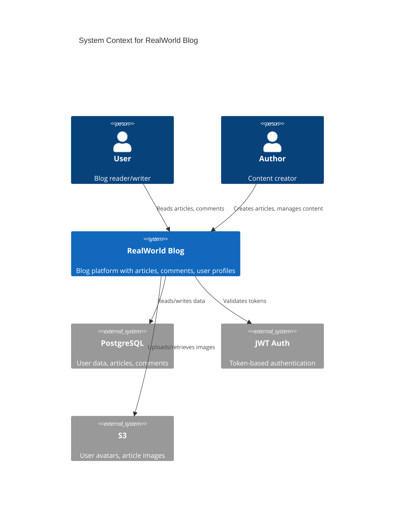

# Test Project Re-evaluation: Libraries vs Real Applications

**Issue Identified:** January 24, 2026  
**Severity:** HIGH - Affects research validity  
**Status:** Requires immediate attention

---

## Problem Statement

### Current Test Projects Are Libraries, Not Applications

Our empirical testing was conducted on **libraries and frameworks** rather than **real applications**:

❌ **Current Projects:**
- Flask-Login - Authentication library
- Typer - CLI framework
- Celery - Task queue library
- Day.js - Date manipulation library
- React Hook Form - Form management library
- PHP-DI - Dependency injection library
- Slim - Microframework
- NestJS - Framework source code
- Laravel - Framework source code

### Why This Is Problematic

**1. Generic Diagrams**
- Libraries show abstract patterns, not concrete implementations
- No real business logic or workflows
- No actual user interactions or API flows
- Missing database schemas and data relationships

**2. Limited Architectural Patterns**
- Libraries lack deployment infrastructure
- No service-to-service communication
- No real-world microservice patterns
- Missing authentication/authorization flows

**3. Not Representative of Real Use Cases**
- Developers don't document libraries (already have docs)
- Real need is for **application documentation**
- Missing end-to-end user journeys
- No complete system architecture

**Example Issue:**
In Flask-Login, the class diagram shows generic authentication mixins, but doesn't show:
- How a real app uses these mixins
- Database models for users
- Login/logout API endpoints
- Session management flow
- Integration with actual views

---

## Proposed Solution: Test on Real Applications

### Criteria for Better Test Projects

✅ **Must Have:**
1. **Full-stack architecture** (frontend + backend + database)
2. **Real business logic** (not just utility functions)
3. **API endpoints** (REST/GraphQL with actual routes)
4. **Database schemas** (models, migrations, relationships)
5. **User workflows** (login, CRUD operations, etc.)
6. **Deployment configs** (Docker, k8s, CI/CD)
7. **Multiple services/components** (for architecture diagrams)

✅ **Size Range:**
- Small: 1,000-5,000 LOC (simple CRUD apps)
- Medium: 5,000-20,000 LOC (full-featured apps)
- Large: 20,000-50,000 LOC (complex systems)

---

## Recommended Test Projects

### Python (Django/Flask Applications)

#### 1. **RealWorld Example App - Django** (Small)
- **Repository:** https://github.com/gothinkster/django-realworld-example-app
- **LOC:** ~2,500
- **Type:** Blog platform (Medium.com clone)
- **Features:**
  - User authentication (register, login, JWT)
  - Article CRUD operations
  - Comments system
  - Follow/unfollow users
  - Favorites/likes
  - REST API with 20+ endpoints
  - PostgreSQL database with 5+ models
  - Token-based authentication

**Why It's Better:**
- ✅ Real user flows (signup → create article → comment)
- ✅ Complete REST API documentation potential
- ✅ Database relationships (User ↔ Article ↔ Comment)
- ✅ Authentication/authorization patterns
- ✅ MVC architecture clearly visible

---

#### 2. **Awesome-Django-Blog** (Medium)
- **Repository:** https://github.com/django-vue-admin/django-vue-admin
- **LOC:** ~8,000-10,000
- **Type:** Admin dashboard + blog
- **Features:**
  - Vue.js frontend + Django backend
  - RBAC (Role-Based Access Control)
  - Content management system
  - File uploads
  - Redis caching
  - Celery background tasks
  - Docker deployment

**Why It's Better:**
- ✅ Full-stack architecture (frontend + backend)
- ✅ Microservice patterns (async tasks)
- ✅ Caching layer visible
- ✅ Deployment infrastructure
- ✅ Admin panel workflows

---

#### 3. **Django-Shop** (Large)
- **Repository:** https://github.com/awesto/django-shop
- **LOC:** ~30,000-40,000
- **Type:** E-commerce platform
- **Features:**
  - Product catalog
  - Shopping cart
  - Payment integration (Stripe)
  - Order management
  - Inventory tracking
  - Multi-currency support
  - RESTful API
  - Complex database schema (10+ models)

**Why It's Better:**
- ✅ Complex business logic (payment processing, inventory)
- ✅ Multi-layered architecture
- ✅ External service integration
- ✅ State machines (order lifecycle)
- ✅ Real-world deployment requirements

---

### JavaScript/TypeScript (Full-Stack Applications)

#### 4. **RealWorld Example - Node.js/Express** (Small)
- **Repository:** https://github.com/gothinkster/node-express-realworld-example-app
- **LOC:** ~3,000
- **Type:** Blog platform API
- **Features:**
  - Express.js REST API
  - MongoDB/Mongoose
  - JWT authentication
  - CRUD operations
  - Article feeds with pagination
  - Social features (follow, favorite)

**Why It's Better:**
- ✅ RESTful API architecture
- ✅ Database models and relationships
- ✅ Authentication middleware
- ✅ Request/response flows

---

#### 5. **Reactive-Resume** (Medium)
- **Repository:** https://github.com/AmruthPillai/Reactive-Resume
- **LOC:** ~15,000
- **Type:** Resume builder (Next.js + NestJS)
- **Features:**
  - Next.js frontend
  - NestJS backend
  - PostgreSQL + Prisma ORM
  - PDF generation
  - Template system
  - User authentication
  - Real-time preview
  - Docker deployment

**Why It's Better:**
- ✅ Modern full-stack (React + NestJS)
- ✅ Microservice architecture
- ✅ Database schema with ORM
- ✅ Document generation pipeline
- ✅ Container orchestration

---

#### 6. **n8n** (Large)
- **Repository:** https://github.com/n8n-io/n8n
- **LOC:** ~50,000+
- **Type:** Workflow automation platform
- **Features:**
  - TypeScript/Node.js backend
  - Vue.js frontend
  - Workflow engine
  - 300+ integrations
  - Webhook system
  - Execution history
  - Multi-node architecture
  - Database (SQLite/PostgreSQL)

**Why It's Better:**
- ✅ Complex system architecture
- ✅ Plugin/extension system
- ✅ Event-driven architecture
- ✅ Scalable design patterns
- ✅ Production-grade deployment

---

### PHP (Full-Stack Applications)

#### 7. **Flarum** (Small-Medium)
- **Repository:** https://github.com/flarum/flarum
- **LOC:** ~8,000
- **Type:** Forum software
- **Features:**
  - Laravel-based
  - Vue.js frontend
  - RESTful API
  - User authentication
  - Discussion threads
  - Tags and categories
  - Extension system
  - MySQL database

**Why It's Better:**
- ✅ Complete forum application
- ✅ API-first architecture
- ✅ Real user interactions
- ✅ Extension architecture
- ✅ Database design patterns

---

#### 8. **Bagisto** (Medium)
- **Repository:** https://github.com/bagisto/bagisto
- **LOC:** ~20,000
- **Type:** E-commerce platform (Laravel)
- **Features:**
  - Multi-channel, multi-currency
  - Product catalog
  - Shopping cart
  - Payment gateways
  - Order management
  - Admin dashboard
  - GraphQL + REST APIs
  - MySQL database with 50+ tables

**Why It's Better:**
- ✅ Enterprise-level architecture
- ✅ Multi-layered system
- ✅ Complex business logic
- ✅ Service layer patterns
- ✅ Real-world e-commerce flows

---

#### 9. **Monica** (Large)
- **Repository:** https://github.com/monicahq/monica
- **LOC:** ~35,000
- **Type:** Personal CRM
- **Features:**
  - Laravel backend
  - Vue.js frontend
  - Contact management
  - Relationship tracking
  - Calendar and reminders
  - Document storage
  - API integration
  - Docker + K8s deployment

**Why It's Better:**
- ✅ Full CRM system
- ✅ Complex data relationships
- ✅ Background job processing
- ✅ File storage patterns
- ✅ Production deployment configs

---

## Alternative: Polyglot Microservices Projects

### Option: Test on Microservice Architectures

**Example: eShopOnContainers (Microsoft)**
- **Repository:** https://github.com/dotnet-architecture/eShopOnContainers
- **LOC:** 50,000+
- **Languages:** C#, JavaScript, Python
- **Architecture:**
  - 10+ microservices
  - API Gateway
  - Service mesh
  - Event bus (RabbitMQ)
  - Databases (SQL + NoSQL)
  - Container orchestration (Docker, K8s)

**Benefits:**
- ✅ Real microservice patterns
- ✅ Service-to-service communication
- ✅ Deployment architecture
- ✅ Event-driven architecture
- ✅ Production-grade system

---

## Comparison: Current vs Proposed Projects

### Current Projects (Libraries)

**Flask-Login Diagram Issues:**
```
Problem: Shows generic UserMixin, LoginManager classes
Missing: Actual user model, login routes, database, session handling
Result: Not helpful for someone trying to understand a real app
```

**Expected Output (Generic):**
- Abstract classes
- Utility functions
- No business logic
- No data flow
- No API endpoints

---

### Proposed Projects (Applications)

**RealWorld Blog Diagram Potential:**
```
C4 Context: User → Blog App → Database + Auth Service
Component: API Router → Article Service → Database
Class: User, Article, Comment models with relationships
Sequence: Login flow, Create article flow, Comment flow
Data Flow: Request → Middleware → Controller → Service → Model → DB
Deployment: Docker → Load Balancer → App Containers → PostgreSQL
```

**Expected Output (Specific):**
- Real business entities
- Actual API endpoints
- Database schema
- User workflows
- Service interactions
- Deployment infrastructure

---

## Impact on Research Paper

### Current Status

**Weaknesses:**
- ❌ Diagrams are too generic
- ❌ Not representative of real use cases
- ❌ Reviewers may question validity
- ❌ Missing real-world architecture patterns

**Risk:** Paper may be rejected for testing on non-representative projects

---

### With Real Applications

**Strengths:**
- ✅ Concrete, actionable diagrams
- ✅ Real-world architecture patterns
- ✅ Demonstrates practical value
- ✅ Shows end-to-end documentation capability

**Impact:** Stronger empirical evidence for research claims

---

## Recommendations

### Immediate Actions

1. **Re-run Tests on 3 Real Applications**
   - RealWorld Blog (Django) - Small
   - Reactive-Resume (Next.js + NestJS) - Medium
   - Monica CRM (Laravel) - Large

2. **Document Diagram Improvements**
   - Compare library vs application diagrams
   - Show concrete business logic
   - Demonstrate API documentation capability

3. **Update Research Paper**
   - Replace/supplement library tests with application tests
   - Add section on "Practical Application Documentation"
   - Include side-by-side comparison

### Long-Term Strategy

1. **Create Test Suite Categories**
   - Category A: Libraries (for framework documentation)
   - Category B: Applications (for business logic documentation)
   - Category C: Microservices (for distributed systems)

2. **Validate Each Category Separately**
   - Different quality metrics for each
   - Different diagram priorities
   - Tailored recommendations

---

## Sample Improved Diagram (RealWorld Blog)

### C4 Context Diagram (Expected)


**This is MUCH more helpful** than generic library diagrams!

---

## Conclusion

**Summary:**
- Current test projects (libraries) produce generic diagrams
- Need to test on real applications with business logic
- Proposed 9 alternative projects (3 per language)
- Will significantly improve research paper validity

**Recommendation:** Re-run empirical testing on at least 3 real applications before paper submission.

**Timeline:**
- Select 3 applications: 1 hour
- Clone and setup: 1 hour
- Run tests: ~30 minutes
- Analyze results: 2 hours
- Update research paper: 2 hours
- **Total:** 6-7 hours

**Risk if not addressed:** Paper rejection due to non-representative testing.

---

**Next Steps:**
1. Approve new test project list
2. Clone and verify projects
3. Run Architector-LLM on each
4. Compare diagrams with current results
5. Update research paper with findings

**Decision Required:** Proceed with re-testing?
