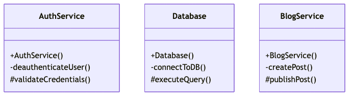
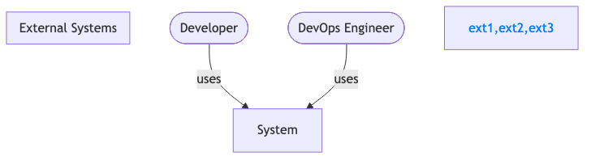
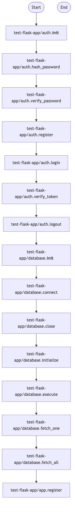

# Architecture Documentation

## Project Overview

**Type:** Cli Tool  
**Primary Language:** Python  
**Complexity:** Tiny (4 files)

### Detected Features
- Object-Oriented Programming

### Frameworks & Technologies
- None detected

---

## Architecture Diagrams

This documentation includes 5 specialized architecture diagrams to provide comprehensive system understanding.

### structural Diagrams

#### Component Diagram

**Priority:** HIGH  
**Purpose:** 🔴 HIGH PRIORITY: Essential for understanding system architecture and module relationships  
**Quality:** 66/100 ❌  

[View Source](diagrams/component.mmd) | [View SVG](diagrams/component.svg)

---

#### Class Diagram

**Priority:** HIGH  
**Purpose:** 🔴 HIGH PRIORITY: OOP design with 3 classes requires class structure visualization  
**Quality:** 89/100 ✅  

[View Source](diagrams/class.mmd) | [View SVG](diagrams/class.svg)

---

### architectural Diagrams

#### C4 System Context Diagram

**Priority:** MEDIUM  
**Purpose:** 🟡 MEDIUM PRIORITY: cli_tool requires system context documentation  
**Quality:** 89/100 ✅  

[View Source](diagrams/c4_context.mmd) | [View SVG](diagrams/c4_context.svg)

---

### behavioral Diagrams

#### Activity Diagram

**Priority:** MEDIUM  
**Purpose:** 🟡 MEDIUM PRIORITY: Complex business logic benefits from workflow visualization  
**Quality:** 89/100 ✅  

[View Source](diagrams/activity.mmd) | [View SVG](diagrams/activity.svg)

---

### data Diagrams

#### Data Flow Diagram

**Priority:** MEDIUM  
**Purpose:** 🟡 MEDIUM PRIORITY: Data processing system benefits from data flow visualization  
**Quality:** 75/100 ⚠️  

[View Source](diagrams/data_flow.mmd) | [View SVG](diagrams/data_flow.svg)

---

## Documentation Index

- [Component Diagrams](docs/structural-diagrams.md) - System structure and modules
- [Behavioral Diagrams](docs/behavioral-diagrams.md) - Interactions and workflows  
- [Data Architecture](docs/data-diagrams.md) - Data flow and storage
- [Quality Report](QUALITY_REPORT.md) - Diagram quality assessment
- [Full Index](INDEX.md) - Complete navigation guide

---

*Generated by Architector-LLM - Multi-Diagram Architecture Documentation System*
