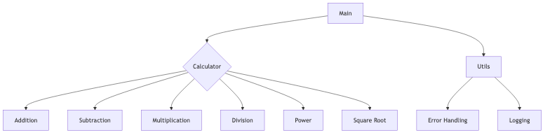
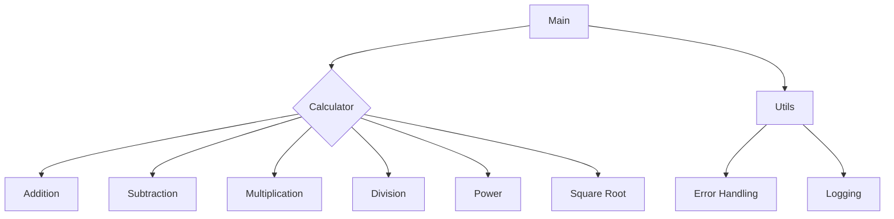

## Architecture Documentation (Markdown)
```markdown
# System Architecture Documentation

## Overview
This system is composed of three main components: 
1. **Calculator**: This component performs basic and scientific calculations. It includes arithmetic operations like addition, subtraction, multiplication, and division as well as power and square root functions.
2. **Utils**: This module provides utility functions for error handling and logging.
3. **Main**: The main function that orchestrates the system by importing the Calculator and Utils modules.

## Components Relationship
1. The Main component uses the Calculator component to perform calculations.
2. Both the Calculator and Utils components are independent of each other, meaning they can be used in different parts of the system without affecting the others.
3. The Utils module provides error handling and logging functionalities that are utilized by both the Calculator and Main modules.
```

## Mermaid Diagram Code

This Mermaid diagram represents the system architecture. The Main module uses the Calculator for calculations, and both modules use the Utils module for error handling and logging functionalities. The Calculator is composed of different arithmetic operations like addition, subtraction, multiplication, division, power, and square root functions.
```
```
```
```
```
```
``
``
``
``
``
``
``
``
``
``
``
``
``
``
``
``
``
``
``
``
``
``
``
``
``
``
``
``
``
``
``
``
``
``
``
``
``
``
``
``
``
``
``
``
``
``
``
``
``
``
``
``
``
``
``
``
``
``
``
``
``
``
``
``
``
``
``
``
``
``
``
``
``
``
``
``
``
``
``
``
``
``
``
``
``
``
``
``
``
``
``
``
``
``
``
``
``
``
``
``
``
``
``
``
``
``
``
``
``
``
``
``
``
``
``
``
``
``
``
``
``
``
``
``
``
``
``
``
``
``
``
``
``
``
``
``
``
``
``
``
``
``
``
``
``
``
``
``
``
``
``
``
``
``
``
``
``
``
``
``
``
``
``
``
``
``
``
``
``
``
``
``
``
``
``
``
``
``
``
``
``
``
``
``
``
``
``
``
``
``
``
``
``
``
``
``
``
``
``
``
``
``
``
``
``
``
``
``
``
``
``
``
``
``
``
``
``
``
``
``
``
``
``
``
``
``
``
``
``
``
``
``
``
``
``
``
``
``
``
``
``
``
``
``
``
``
``
``
``
``
``
``
``
``
``
``
``
``
``
``
``
``
``
``
``
``
``
``
``
``
``
``
``
``
``
``
``
``
``
``
``
``
``
``
``
``
``
``
``
``
``
``
``
``
``
``
``
``
``
``
``
``
``
``
``
``
``
``
``
``
``
``
``
``
``
``
``
``
``
``
``
``
``
``
``
``
``
``
``
``
``
``
``
``
``
``
``
``
``
``
``
``
``
``
``
``
``
``
``
``
``
``
``
``
``
``
``
``
``
``
``
``
``
``
``
``
``
``
``
``
``
``
``
``
``
``
``
``
``
``
``
``
``
``
``
``
``
``
``
``
``
``
``
``
``
``
``
``
``
``
``
``
``
``
``
``
``
``
``
``
``
``
``
``
``
``
``
``
``
``
``
``
``
``
``
``
``
``
``
``
``
``
``
``
``
``
``
``
``
``
``
``
``
``
``
``
``
``
``
``
``
``
``
``
``
``
``
``
``
``
``
``
``
``
``
``
``
``
``
``
``
``
``
``
``
``
``
``
``
``
``
``
``
``
``
``
``
``
``
``
``
``
``
``
``
``
``
``
``
``
``
``
``
``
``
``
``
``
``
``
``
``
``
``
``
``
``
``
``
``
``
``
``
``
``
``
``
``
``
``
``
``
``
``
``
``
``
``
``
``
``
``
``
``
``
``
``
``
``
``
``
``
``
``
``
``
``
``
``
``
``
``
``
``
``
``
``
``
``
``
``
``
``
``
``
``
``
``
``
``
``
``
``
``
``
``
``
``
``
``
``
``
``
``
``
``
``
``
``
``
``
``
``
``
``
``
``
``
``
``
``
``
``
``
``
``
``
``
``
``
``
``
``
``
``
``
``
``
``
``
``
``
``
``
``
``
``
``
``
``
``
``
``
``
``
``
``
``
``
``
``
``
``
``
``
``
``
``
``
``
``
``
``
``
``
``
``
``
``
``
``
``
``
``
``
``
``
``
``
``
``
``
``
``
``
``
``
``
``
``
``
``
``
``
``
``
``
``
``
``
``
``
``
``
``
``
``
``
``
``
``
``
``
``
``
``
``
``
``
``
``
``
``
``
``
``
``
``
``
``
``
``
``
``
``
``
``
``
``
``
``
``
``
``
``
``
``
``
``
``
``
``
``
``
``
``
``
``
``
``
``
``
``
``
``
``
``
``
``
``
``
``
``
``
``
``
``
``
``
``
``
``
``
``
``
``
``
``
``
``
``
``
``
``
``
``
``
``
``
``
``
``
``
``
``
``
``
``
``
``
``
``
``
``
``
``
``
``
``
``
``
``
``
``
``
``
``
``
``
``
``
``
``
``
``
``
``
``
``
``
``
``
``
``
``
``
``
``
``
``
``
``
``
``
``
``
``
``
``
``
``
``
``
``
``
``
``
``
``
``
``
``
``
``
``
``
``
``
``
``
``
``
``
``
``
``
``
``
``
``
``
``
``
``
``
``
``
``
``
``
``
``
``
``
``
``
``
``
``
``
``
``
``
``
``
``
``
``
``
``
``
``
``
``
``
``
``
``
``
``
``
``
``
``
``
``
``
``
``
``
``
``
``
``
``
``
``
``
``
``
``
``
``
``
``
``
``
``
``
``
``
``
``
``
``
``
``
``
``
``
``
``
``
``
``
``
``
``
``
``
``
``
``
``
``
``
``
``
``
``
``
``
``
``
``
``
``
``
``
``
``
``
``
``
``
``
``
``
``
``
``
``
``
``
``
``
``
``
``
``
``
``
``
``
``
``
``
``
``
``
``
``
``
``
``
``
``
``
``
``
``
``
``
``
``
``
``
``
``
``
``
``
``
``
``
``
``
``
``
``
``
``
``
``
``
``
``
``
``
``
``
``
``
``
``
``
``
``
``
``
``
``
``
``
``
``
``
``
``
``
``
``
``
``
``
``
``
``
``
``
``
``
``
``
``
``
``
``
``
``
``
``
``
``
``
``
``
``
``
``
``
``
``
``
``
``
``
``
``
``
``
``
``
``
``
``
``
``
``
``
``
``
``
``
``
``
``
``
``
``
``
``
``
``
``
``
``
``
``
``
``
``
``
``
``
``
``
``
``
``
``
``
``
``
``
``
``
``
``
``
``
``
``
``
``
``
``
``
``
``
``
``
``
``
``
``
``
``
``
``
``
``
``
``
``
``
``
``
``
``
``
``
``
``
``
``
``
``
``
``
``
``
``
``
``
``
``
``
``
``
``
``
``
``
``
``
``
``
``
``
``
``
``
``
``
``
``
``
``
``
``
``
``
``
``
``
``
``
``
``
``
``
``
``
``
``
``
``
``
``
``
``
``
``
``
``
``
``
``
``
``
``
``
``
``
``
``
``
``
``
``
``
``
``
``
``
``
``
``
``
``
``
``
``
``
``
``
``
``
``
``
``
``
``
``
``
``
``
``
``
``
``
``
``
``
``
``
``
``
``
``
``
``
``
``
``
``
``
``
``
``
``
``
``
``
``
``
``
``
``
``
``
``
``
``
``
``
``
``
``
``
``
``
``
``
``
``
``
``
``
``
``
``
``
``
``
``
``
``
``
``
``
``
``
``
``
``
``
``
``
``
``
``
``
``
``
``
``
``
``
``
``
``
``
``
``
``
``
``
``
``
``
``
``
``
``
``
``
``
``
``
``
``
``
``
``
``
``
``
``
``
``
``
``
``
``
``
``
``
``
``
``
``
``
``
``
``
``
``
``
``
``
``
``
``
``
``
``
``
``
``
``
``
``
``
``
``
``
``
``
``
``
``
``
``
``
``
``
``
``
``
``
``
``
``
``
``
``
``
``
``
``
``
``
``
``
``
``
``
``
``
``
``
``
``
``
``
``
``
``
``
``
``
``
``
``
``
``
``
``
``
``
``
``
``
``
``
``
``
``
``
``
``
``
``
``
``
``
``
``
``
``
``
``
``
``
``
``
``
``
``
``
``
``
``
``
``
``
``
``
``
``
``
``
``
``
``
``
``
``
``
``
``
``
``
``
``
``
``
``
``
``
``
``
``
``
``
``
``
``
``
``
``
``
``
``
``
``
``
``
``
``
``
``
``
``
``
``
``
``
``
``
``
``
``
``
``
``
``
``
``
``
``
``
``
``
``
``
``
``
``
``
``
``
``
``
``
``
``
``
``
``
``
``
``
``
``
``
``
``
``
``
``
``
``
``
``
``
``
``
``
``
``
``
``
``
``
``
``
``
``
``
``
``
``
``
``
``
``
``
``
``
``
``
``
``
``
``
``
``
``
``
``
``
``
``
``
``
``
``
``
``
``
``
``
``
``
``
``
``
``
``
``
``
``
``
``
``
``
``
``
``
``
``
``
``
``
``
``
``
``
``
``
``
``
``
``
``
``
``
``
``
``
``
``
``
``
``
``
``
``
``
``
``
``
``
``
``
``
``
``
``
``
``
``
``
``
``
``
``
``
``
``
``
``
``
``
``
``
``
``
``
``
``
``
``
``
``
``
``
``
``
``
``
``
``
``
``
``
``
``
``
``
``
``
``
``
``
``
``
``
``
``
``
``
``
``
``
``
``
``
``
``
``
``
``
``
``
``
``
``
``
``
``
``
``
``
``
``
``
``
``
``
``
``
``
``

---

## Architecture Diagram

### Visual Diagram



*Click the image to view in full size. SVG version available at [diagrams/architecture.svg](diagrams/architecture.svg)*

### Mermaid Source Code



*This diagram can be edited and viewed in VS Code, GitHub, or any Mermaid-compatible viewer.*

